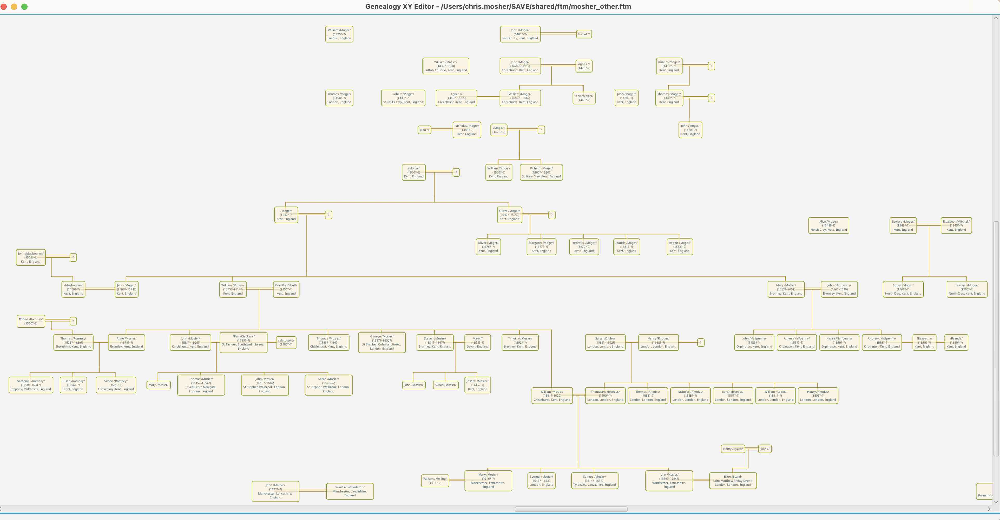

# Gedcom-XY-Editor

Copyright © 2000–2022, Christopher Alan Mosher, Shelton, Connecticut, USA, <cmosher01@gmail.com>.

Lets you edit (x,y) coordinate positions of
individuals in a GEDCOM file, graphically on a traditional drop-line chart.

The program has a genealogically oriented *layout algorithm*, to automatically
arrange the individuals by family relationships.

It can export the chart as a PDF file or an SVG file.

The program allows for an optional “skeleton” export, with minimal identifying
information for individuals, intended for *merging* into an existing GEDCOM
file.
