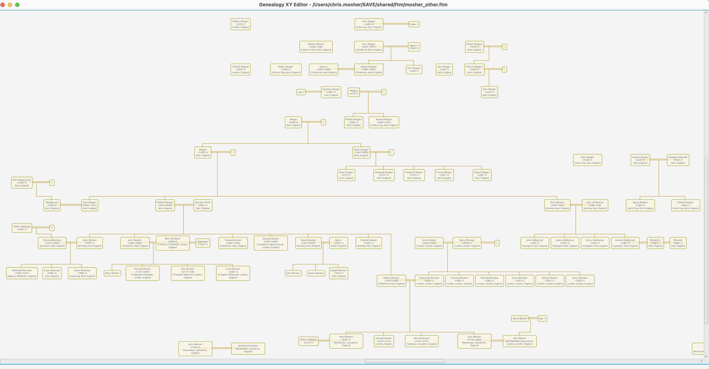

# Gedcom-XY-Editor

Copyright © 2000–2026, Christopher Alan Mosher,
New York, USA, <cmosher01@gmail.com>.

Lets you edit `(x,y)` coordinate positions of
individuals in a GEDCOM file, graphically on a traditional
drop-line chart.

The program has a genealogically oriented *layout algorithm*, to
automatically  arrange the individuals by family relationships.

It can export the chart as a `PDF` file or an `SVG` file.

The program allows for an optional “skeleton” export, with minimal
identifying information for individuals, intended for *merging*
into an existing GEDCOM file.

## Interacting with the chart editor

### Mouse, trackpad, etc.

Drag people around to arrange them nicely. Drag an individual
person to move them.

Select multiple people to drag them as a group:

* Click a person to toggle them in/out of the current selection.
* Shift-click (on the background) and drag to select multiple
people at once.
* Click on the background to clear the current selection.

Drag the background to pan the chart; scroll to zoom in or out.

### Menu commands

* **Export Changed As Skeletons**\
    Export stripped-down GEDCOM file with coordinates,
    with just people that have been moved,
    for _merging_ back into your tree.

* **Export ALL As Skeletons**\
    Export stripped-down GEDCOM file with coordinates,
    with **all** people,
    for _merging_ back into your tree.

* **Save As**\
    Export new full GEDCOM file.

* **Export As PDF**\
    Export chart as a PDF file.

* **Export As SVG**\
    Export chart as an SVG file.

* **Preferences**\
    Edit preferences: snap to grid.

* **Nudge**\
    Moves the Selection nearer to the nearest non-selected parent,
    sibling, spouse, or child, of anyone in the Selection.

* **Reset Scale 1:1**\
    Sets scale 1:1.

* **Center**\
    Scrolls to the center of the chart.

* **Fit**\
    Zooms to fit the whole chart on the screen.

* **Jump To Selection**\
    Scrolls to the current selection; subsequent
    jumps toggle between there and the previous location.
